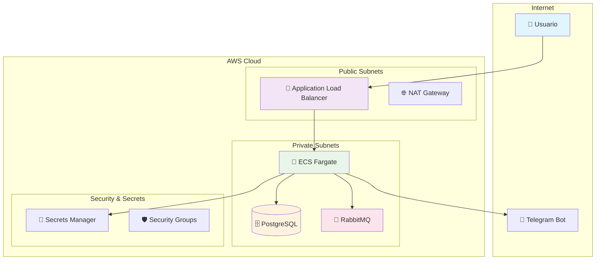
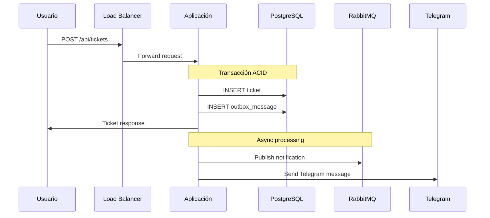
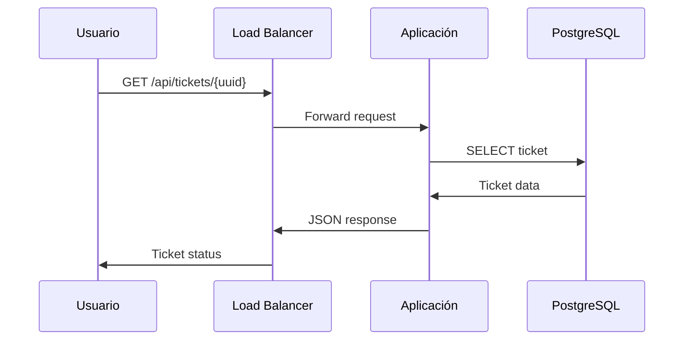

# 🏛️ Arquitectura del Sistema Ticketero

## 📋 Resumen Ejecutivo

El sistema Ticketero es una solución completa de gestión de colas bancarias que combina una aplicación Java moderna con infraestructura AWS escalable y segura.

## 🎯 Objetivos de Arquitectura

- **Escalabilidad**: Manejo de picos de demanda automático
- **Disponibilidad**: 99.9% uptime con recuperación automática
- **Seguridad**: Credenciales seguras y red aislada
- **Observabilidad**: Monitoreo completo y alertas
- **Costo-Eficiencia**: Recursos optimizados para cada ambiente

## 🏗️ Vista de Alto Nivel



## 🔧 Componentes Técnicos

### 📱 Aplicación Java

**Stack Tecnológico:**
- **Runtime**: Java 21 (LTS)
- **Framework**: Spring Boot 3.2
- **Base de Datos**: PostgreSQL 16
- **Mensajería**: RabbitMQ 3.13
- **Containerización**: Docker multi-stage

**Patrones Implementados:**
- **Outbox Pattern**: Consistencia transaccional
- **Circuit Breaker**: Resiliencia ante fallos
- **Health Checks**: Monitoreo de estado
- **Graceful Shutdown**: Cierre controlado

### 🏗️ Infraestructura AWS

#### Red y Conectividad
```
VPC (10.0.0.0/16)
├── Public Subnets (2 AZs)
│   ├── 10.0.1.0/24 (us-east-1a)
│   └── 10.0.2.0/24 (us-east-1b)
└── Private Subnets (2 AZs)
    ├── 10.0.3.0/24 (us-east-1a)
    └── 10.0.4.0/24 (us-east-1b)
```

#### Compute y Aplicación
- **ECS Fargate**: Serverless containers
- **Auto Scaling**: 1-3 tareas basado en CPU
- **Application Load Balancer**: Distribución de tráfico
- **Target Groups**: Health checks en `/actuator/health`

#### Datos y Persistencia
- **RDS PostgreSQL**: Multi-AZ para alta disponibilidad
- **Automated Backups**: 7 días de retención
- **Encryption**: En tránsito y en reposo

#### Mensajería
- **Amazon MQ**: RabbitMQ managed
- **Deployment Mode**: Single instance (dev)
- **Engine Version**: 3.13.x

## 🔒 Seguridad

### Modelo de Seguridad por Capas

```
┌─────────────────────────────────────────┐
│           Internet Gateway              │ ← Punto de entrada
├─────────────────────────────────────────┤
│        Application Load Balancer       │ ← SSL Termination
├─────────────────────────────────────────┤
│           Security Groups               │ ← Firewall de red
├─────────────────────────────────────────┤
│          Private Subnets                │ ← Aislamiento de red
├─────────────────────────────────────────┤
│         IAM Roles & Policies            │ ← Control de acceso
├─────────────────────────────────────────┤
│          Secrets Manager                │ ← Gestión de credenciales
└─────────────────────────────────────────┘
```

### Security Groups

| Grupo | Protocolo | Puerto | Origen | Descripción |
|-------|-----------|--------|--------|--------------|
| ALB-SG | TCP | 80 | 0.0.0.0/0 | HTTP público |
| ALB-SG | TCP | 443 | 0.0.0.0/0 | HTTPS público |
| App-SG | TCP | 8080 | ALB-SG | Solo desde ALB |
| DB-SG | TCP | 5432 | App-SG | Solo desde App |
| MQ-SG | TCP | 5671 | App-SG | Solo desde App |

### Gestión de Secretos

```yaml
Secrets Manager:
  - ticketero-dev-db-credentials:
      username: postgres
      password: <auto-generated>
      
  - ticketero-dev-mq-credentials:
      username: admin
      password: <auto-generated>
      
  - ticketero-dev-telegram-credentials:
      bot_token: <manual>
      chat_id: <manual>
```

## 📊 Flujo de Datos

### 1. Creación de Ticket



### 2. Consulta de Estado



## 🚀 Despliegue y CI/CD

### Pipeline de Despliegue

```yaml
Stages:
  1. 🧪 Test:
     - Unit tests (JUnit 5)
     - Integration tests (TestContainers)
     - Code coverage (JaCoCo)
     
  2. 🔒 Security:
     - Vulnerability scan (Trivy)
     - Dependency check
     - SAST analysis
     
  3. 🐳 Build:
     - Docker image build
     - Multi-stage optimization
     - Image scanning
     
  4. 🏗️ Infrastructure:
     - CDK synthesis
     - CloudFormation validation
     - Cost estimation
     
  5. 🚀 Deploy:
     - Infrastructure deployment
     - Application deployment
     - Smoke tests
```

### Estrategia de Ambientes

| Ambiente | Propósito | Recursos | Auto-Deploy |
|----------|-----------|----------|--------------|
| **Development** | Desarrollo activo | Mínimos | ✅ main branch |
| **Staging** | Testing pre-prod | Similares a prod | 🔄 Manual |
| **Production** | Producción | Completos | 🔄 Manual + Approval |

## 📈 Monitoreo y Observabilidad

### Métricas Clave

```yaml
Application Metrics:
  - tickets.created.total
  - tickets.processed.duration
  - queue.size.current
  - notifications.sent.total
  
Infrastructure Metrics:
  - ecs.cpu.utilization
  - ecs.memory.utilization
  - rds.connections.count
  - alb.request.count
  
Business Metrics:
  - average.wait.time
  - customer.satisfaction
  - peak.hours.load
```

### Alertas

| Métrica | Umbral | Acción |
|---------|--------|---------|
| CPU > 80% | 5 min | Auto-scale |
| Memory > 85% | 3 min | Alert + Scale |
| Error Rate > 5% | 1 min | Immediate alert |
| DB Connections > 80% | 2 min | Alert |

## 💰 Optimización de Costos

### Estrategias Implementadas

1. **Right-sizing**: Instancias apropiadas por ambiente
2. **Auto Scaling**: Recursos bajo demanda
3. **Spot Instances**: Para cargas no críticas
4. **Reserved Instances**: Para recursos base
5. **Lifecycle Policies**: Limpieza automática

### Estimación de Costos (Mensual)

| Ambiente | Compute | Database | Network | Storage | Total |
|----------|---------|----------|---------|---------|-------|
| **Dev** | $25 | $35 | $45 | $10 | **$115** |
| **Staging** | $50 | $70 | $60 | $20 | **$200** |
| **Prod** | $200 | $300 | $100 | $50 | **$650** |

## 🔄 Disaster Recovery

### RTO/RPO Objetivos

- **RTO (Recovery Time Objective)**: 15 minutos
- **RPO (Recovery Point Objective)**: 5 minutos

### Estrategias

1. **Multi-AZ Deployment**: Failover automático
2. **Automated Backups**: Point-in-time recovery
3. **Cross-Region Replication**: Para casos críticos
4. **Infrastructure as Code**: Recreación rápida

## 📚 Referencias

- [AWS Well-Architected Framework](https://aws.amazon.com/architecture/well-architected/)
- [Spring Boot Best Practices](https://spring.io/guides)
- [PostgreSQL Performance Tuning](https://www.postgresql.org/docs/current/performance-tips.html)
- [RabbitMQ Clustering Guide](https://www.rabbitmq.com/clustering.html)

---

**📝 Nota**: Esta arquitectura está diseñada para evolucionar. Se recomienda revisar y actualizar según las necesidades del negocio y nuevas tecnologías disponibles.