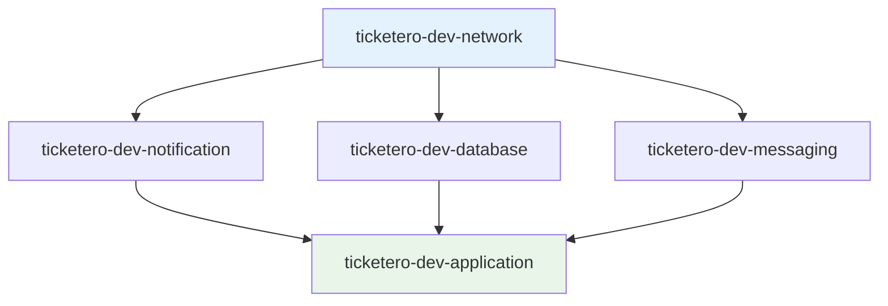

# 🚀 Guía de Despliegue - Sistema Ticketero

## 📋 Resumen

Esta guía detalla el proceso completo de despliegue del sistema Ticketero en AWS, desde la configuración inicial hasta el monitoreo post-despliegue.

## 🎯 Prerrequisitos

### Herramientas Requeridas

| Herramienta | Versión Mínima | Propósito |
|-------------|----------------|------------|
| **Java** | 21+ | Runtime de aplicación |
| **Maven** | 3.9+ | Build tool |
| **Node.js** | 18+ | CDK CLI |
| **AWS CLI** | 2.x | Gestión AWS |
| **Docker** | 20+ | Containerización |
| **Git** | 2.x | Control de versiones |

### Verificación de Prerrequisitos

```bash
# Verificar versiones
java --version          # Debe mostrar Java 21+
mvn --version          # Debe mostrar Maven 3.9+
node --version         # Debe mostrar Node 18+
aws --version          # Debe mostrar AWS CLI v2
docker --version       # Debe mostrar Docker 20+
git --version          # Debe mostrar Git 2.x+
```

## 🔧 Configuración Inicial

### 1. Configurar AWS CLI

```bash
# Configurar credenciales
aws configure
# AWS Access Key ID: [tu-access-key]
# AWS Secret Access Key: [tu-secret-key]
# Default region name: us-east-1
# Default output format: json

# Verificar configuración
aws sts get-caller-identity
```

### 2. Instalar AWS CDK

```bash
# Instalar CDK globalmente
npm install -g aws-cdk@2.170.0

# Verificar instalación
cdk --version
```

### 3. Configurar Variables de Entorno

```bash
# Obtener Account ID
export CDK_DEFAULT_ACCOUNT=$(aws sts get-caller-identity --query Account --output text)
export CDK_DEFAULT_REGION=us-east-1

# Verificar variables
echo "Account: $CDK_DEFAULT_ACCOUNT"
echo "Region: $CDK_DEFAULT_REGION"
```

## 🏗️ Despliegue de Infraestructura

### Paso 1: Bootstrap CDK (Solo Primera Vez)

```bash
cd ticketero-infra

# Bootstrap del entorno AWS
cdk bootstrap aws://$CDK_DEFAULT_ACCOUNT/$CDK_DEFAULT_REGION
```

**Salida esperada:**
```
✅ Environment aws://123456789012/us-east-1 bootstrapped.
```

### Paso 2: Validar Configuración

```bash
# Compilar el proyecto CDK
mvn compile

# Sintetizar templates de CloudFormation
cdk synth

# Ver diferencias (primera vez mostrará todos los recursos)
cdk diff
```

### Paso 3: Desplegar Stacks

```bash
# Opción 1: Desplegar todos los stacks
cdk deploy --all --require-approval never

# Opción 2: Desplegar stack por stack
cdk deploy ticketero-dev-network
cdk deploy ticketero-dev-notification
cdk deploy ticketero-dev-database
cdk deploy ticketero-dev-messaging
cdk deploy ticketero-dev-application
```

**⏱️ Tiempo estimado**: 15-20 minutos

### Orden de Despliegue



## 📊 Monitoreo del Despliegue

### Verificar Estado de Stacks

```bash
# Listar todos los stacks
cdk list

# Ver estado en AWS Console
aws cloudformation describe-stacks \
  --region us-east-1 \
  --query 'Stacks[?starts_with(StackName, `ticketero-dev`)].{Name:StackName,Status:StackStatus}' \
  --output table
```

### Obtener Outputs Importantes

```bash
# URL de la aplicación
aws cloudformation describe-stacks \
  --stack-name ticketero-dev-application \
  --query 'Stacks[0].Outputs[?OutputKey==`ServiceUrl`].OutputValue' \
  --output text

# Endpoint de base de datos
aws cloudformation describe-stacks \
  --stack-name ticketero-dev-database \
  --query 'Stacks[0].Outputs[?OutputKey==`DbEndpoint`].OutputValue' \
  --output text
```

## 🔧 Configuración Post-Despliegue

### 1. Configurar Secretos de Telegram

```bash
# Obtener ARN del secreto
TELEGRAM_SECRET_ARN=$(aws cloudformation describe-stacks \
  --stack-name ticketero-dev-notification \
  --query 'Stacks[0].Outputs[?OutputKey==`TelegramSecretArn`].OutputValue' \
  --output text)

# Actualizar secreto con credenciales reales
aws secretsmanager update-secret \
  --secret-id $TELEGRAM_SECRET_ARN \
  --secret-string '{
    "bot_token": "tu-telegram-bot-token",
    "chat_id": "tu-telegram-chat-id"
  }'
```

### 2. Verificar Conectividad de Base de Datos

```bash
# Obtener endpoint de RDS
DB_ENDPOINT=$(aws cloudformation describe-stacks \
  --stack-name ticketero-dev-database \
  --query 'Stacks[0].Outputs[?OutputKey==`DbEndpoint`].OutputValue' \
  --output text)

echo "Database endpoint: $DB_ENDPOINT"

# Verificar conectividad (desde una instancia en la VPC)
# telnet $DB_ENDPOINT 5432
```

### 3. Verificar Salud de la Aplicación

```bash
# Obtener URL de la aplicación
APP_URL=$(aws cloudformation describe-stacks \
  --stack-name ticketero-dev-application \
  --query 'Stacks[0].Outputs[?OutputKey==`ServiceUrl`].OutputValue' \
  --output text)

# Verificar health check
curl $APP_URL/actuator/health

# Verificar métricas
curl $APP_URL/actuator/prometheus
```

## 🧪 Pruebas Post-Despliegue

### Smoke Tests

```bash
#!/bin/bash
# smoke-tests.sh

APP_URL="http://tu-alb-url.us-east-1.elb.amazonaws.com"

echo "🧪 Ejecutando smoke tests..."

# Test 1: Health Check
echo "1. Verificando health check..."
if curl -f $APP_URL/actuator/health > /dev/null 2>&1; then
    echo "✅ Health check OK"
else
    echo "❌ Health check FAILED"
    exit 1
fi

# Test 2: Crear ticket
echo "2. Creando ticket de prueba..."
RESPONSE=$(curl -s -X POST $APP_URL/api/tickets \
  -H "Content-Type: application/json" \
  -d '{
    "tipoServicio": "CAJA",
    "prioridad": "NORMAL",
    "clienteId": "12345678",
    "telefonoNotificacion": "+56912345678"
  }')

if echo $RESPONSE | grep -q "numero"; then
    echo "✅ Creación de ticket OK"
    TICKET_UUID=$(echo $RESPONSE | jq -r '.uuid')
else
    echo "❌ Creación de ticket FAILED"
    exit 1
fi

# Test 3: Consultar ticket
echo "3. Consultando ticket..."
if curl -f $APP_URL/api/tickets/$TICKET_UUID > /dev/null 2>&1; then
    echo "✅ Consulta de ticket OK"
else
    echo "❌ Consulta de ticket FAILED"
    exit 1
fi

echo "🎉 Todos los smoke tests pasaron!"
```

### Load Testing (Opcional)

```bash
# Instalar Apache Bench
sudo apt-get install apache2-utils

# Test de carga básico
ab -n 100 -c 10 $APP_URL/actuator/health

# Test de creación de tickets
ab -n 50 -c 5 -p ticket-payload.json -T application/json $APP_URL/api/tickets
```

## 📊 Monitoreo Continuo

### CloudWatch Dashboards

```bash
# Crear dashboard personalizado
aws cloudwatch put-dashboard \
  --dashboard-name "Ticketero-Dev" \
  --dashboard-body file://cloudwatch-dashboard.json
```

### Alertas Críticas

```bash
# Crear alarma para CPU alta
aws cloudwatch put-metric-alarm \
  --alarm-name "Ticketero-HighCPU" \
  --alarm-description "CPU utilization is too high" \
  --metric-name CPUUtilization \
  --namespace AWS/ECS \
  --statistic Average \
  --period 300 \
  --threshold 80 \
  --comparison-operator GreaterThanThreshold \
  --evaluation-periods 2
```

## 🔄 Actualizaciones y Rollbacks

### Actualizar Aplicación

```bash
# 1. Actualizar código en el repositorio
git push origin main

# 2. Redesplegar solo la aplicación
cdk deploy ticketero-dev-application

# 3. Verificar despliegue
curl $APP_URL/actuator/health
```

### Rollback de Emergencia

```bash
# Opción 1: Rollback via CloudFormation
aws cloudformation cancel-update-stack \
  --stack-name ticketero-dev-application

# Opción 2: Rollback via CDK (a versión anterior)
git checkout <previous-commit>
cdk deploy ticketero-dev-application
```

## 🧹 Limpieza y Destrucción

### Destruir Ambiente Completo

```bash
# ⚠️ CUIDADO: Esto eliminará todos los recursos
cdk destroy --all

# Confirmar eliminación cuando se solicite
```

### Destruir Stack Específico

```bash
# Destruir solo la aplicación
cdk destroy ticketero-dev-application

# Destruir en orden inverso para evitar dependencias
cdk destroy ticketero-dev-application
cdk destroy ticketero-dev-messaging
cdk destroy ticketero-dev-database
cdk destroy ticketero-dev-notification
cdk destroy ticketero-dev-network
```

## 🚨 Troubleshooting

### Problemas Comunes

#### 1. Error de Bootstrap
```bash
# Error: "CDK_DEFAULT_ACCOUNT not set"
# Solución:
export CDK_DEFAULT_ACCOUNT=$(aws sts get-caller-identity --query Account --output text)
```

#### 2. Error de Compilación Java
```bash
# Error: "release version 21 not supported"
# Solución: Verificar JAVA_HOME
export JAVA_HOME=/path/to/java-21
java --version
```

#### 3. Error de Permisos AWS
```bash
# Error: "User is not authorized"
# Solución: Verificar políticas IAM
aws sts get-caller-identity
aws iam list-attached-user-policies --user-name tu-usuario
```

#### 4. Timeout de Despliegue
```bash
# Si el despliegue se cuelga, verificar en AWS Console
# CloudFormation > Stacks > [stack-name] > Events
```

### Logs y Debugging

```bash
# Ver logs de ECS
aws logs describe-log-groups --log-group-name-prefix "/ecs/ticketero"

# Ver logs específicos
aws logs tail /ecs/ticketero-dev --follow

# Ver eventos de CloudFormation
aws cloudformation describe-stack-events \
  --stack-name ticketero-dev-application \
  --query 'StackEvents[0:10].{Time:Timestamp,Status:ResourceStatus,Reason:ResourceStatusReason}' \
  --output table
```

## 📞 Soporte

### Contactos de Emergencia
- **DevOps Team**: devops@empresa.com
- **On-Call**: +56-9-XXXX-XXXX
- **Slack**: #ticketero-support

### Documentación Adicional
- [Runbook de Operaciones](./OPERATIONS.md)
- [Guía de Monitoreo](./MONITORING.md)
- [Procedimientos de Emergencia](./EMERGENCY.md)

---

**✅ Checklist de Despliegue Exitoso:**
- [ ] Prerrequisitos verificados
- [ ] AWS CLI configurado
- [ ] CDK bootstrapped
- [ ] Todos los stacks desplegados
- [ ] Secretos configurados
- [ ] Smoke tests pasados
- [ ] Monitoreo configurado
- [ ] Documentación actualizada